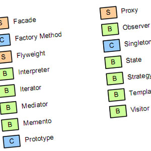

   Based on my knowledge before this module on design patterns, If I was interviewed and asked the two questions, what are design patterns and what design patterns have you used in code, I would put on my best fake smile and give the most roundabout answer to the interviewer that would probably put me in a worse position that I started with, however, after reading this module I can confidently say that I now have a basic understanding to what design patterns are and how they are used. At least that is an improvement, right? Now I could quote a bunch of Wikipedia pages, other webpages, and the book “Design Patterns: Elements of Reusable Object-Oriented Software” by the Gang of Four to showcase what I learned about this topic but that might be a bit to boring. Instead I will use an analogy utilizing clothes.

   To me, clothes can encapsulate the three classifications of design patterns well without much mental gymnastics to make it work, take a t-shirt for example. Unless evolution takes its hold on humanity and we grow extra limbs, T-shirts will never change. Utilizing the vocabulary in each classification a T-shirt can be created in an “Abstract factory” as all factories that produce T-shirts have a common theme in creation of a T-shirt or perhaps a single “Prototype” as they have machines, or people, that create sleeves, the torso, the hem stitches, the correct length, etc. Now a T-shirt can have a design or a structure that makes some T-shirts more unique. “Decorators” are placed onto the shirt such as changes of color, pockets, or even buttons. These decorators do make the T-shirts unique to us however on the bottom line they will never move from the classification of a T-shirt. The behavioral patterns of the T-shirts rely on us, the client, as we can “Command” orders to the factories to create “Decorators” or perhaps utilize a clothing’s “Memento” to wash or iron it to change it back to the original state of the shirt. These analogies I created after reading about design patterns helped me understand the relationship of each design pattern classification has internally as well as how relationship they each share between them.
   
   After this understanding I can now answer the question, What design patterns have you used in code? My “T-shirt” I utilized in the code the most that probably has the most similarities to my analogy is the Semantic UI Grid functionality. Semantic UI created this “Abstract Factory” to mass produce grids and can be “Prototyped” using these lines

```
<div class="ui grid">
</div>
```
   I can add “Decorators” that can alter size.
```
<div class="ui grid">
  <div class="eight wide column"></div>
  <div class="eight wide column"></div>
  <div class="ten wide column"></div>
</div>
```
   Or color.
```
<div class="ui five column padded grid">
  <div class="red column">Red</div>
</div>
```
   Then if I the client gets to crazy with requests with this grid functionality I can always revert to its internal state.
```
<div class="ui grid">
</div>
```
   In conclusion, although I did not know what design patterns are, I have been using them during most of my programming life. This makes me feel a bit better since I technically didn’t lie to the interviewer when asked those two questions but now, I can change that fake smile to a real smile.
