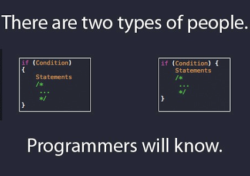

   Based on my knowledge before this module on design patterns, If I was interviewed and asked the two questions, what are design patterns and what design patterns have you used in code, I would put on my best fake smile and give the most roundabout answer to the interviewer that would probably put me in a worse position that I started with, however, after reading this module I can confidently say that I now have a basic understanding to what design patterns are and how they are used. At least that is an improvement, right? Now I could quote a bunch of Wikipedia pages, other webpages, and the book “Design Patterns: Elements of Reusable Object-Oriented Software” by the Gang of Four to showcase what I learned about this topic but that might be a bit to boring. Instead I will use an analogy utilizing clothes.

   To me, clothes can encapsulate the three classifications of design patterns well without much mental gymnastics to make it work, take a t-shirt for example. Unless evolution takes its hold on humanity and we grow extra limbs, T-shirts will never change. Utilizing the vocabulary in each classification a T-shirt can be created in an “Abstract factory” as all factories that produce T-shirts have a common theme in creation of a T-shirt or perhaps a single “Prototype” as they have machines, or people, that create sleeves, the torso, the hem stitches, the correct length, etc. Now a T-shirt can have a design or a structure that makes some T-shirts more unique. “Decorators” are placed onto the shirt such as changes of color, pockets, or even buttons. These decorators do make the T-shirts unique to us however on the bottom line they will never move from the classification of a T-shirt. The behavioral patterns of the T-shirts rely on us, the client, as we can “Command” orders to the factories to create “Decorators” or perhaps utilize a clothing’s “Memento” to wash or iron it to change it back to the original state of the shirt. These analogies I created after reading about design patterns helped me understand the relationship of each design pattern classification has internally as well as how relationship they each share between them.

```
//unreadable code
	function everynum(data){
	let i = 0;
	let b = 1;
	while(i<data)
	i++;
	b++;
	return i;}
```
```
//readable code
function countUpTo(data) {
	let counter = 0;
	let variableThatDoesNothing = 0;
	while(isum < data) {
		counter++;
	}
	variableThatDoesNothing++;
	return counter;
}
```
Although both codes achieve the same goal having proper indentation and figure brackets allow better readability and having proper variable names provide no ambiguity to what data is being stored. Thus, from having great readability there is great maintainability.

 From our adventure in “Fixing Bad JavaScript” having a general coding standard allows a large group, our class for example, to be able to understand each other’s code and is a great boon for both our grader in class as well as being a great experience to force adjustment to our own personal coding standards. I do believe in the opinion that if you can only implement one software engineering technique to improve quality, it should be coding standards. Being able to write code in such a way that readability, maintainability, and portability is as important as achieving the initial goal of the program for the real world and tools like ESLint with IntelliJ is a very great combination to automate and force certain coding standards on people as no one wants to see red “x” anywhere in their program. Achieving the green checkmark is a goal in of itself and although frustrating at times I do see the usefulness.

Speaking of portability, I have seen this first hand as taking the ICS212 Program Structure forced certain coding standards on myself to better help the portability of code between operating systems. Tabs on windows may not be the same as on other operating systems and thus if tabs were used in our source code the grader would see very, very, ugly indentation and made reading code unbearable to the point that if tabs were used in the source code we would be docked points immediately. So as part of the class coding standard we used 4 spaces for indentation as the space character is the same length in all operating systems.
	
In conclusion, I do believe that having readable code is a must in all instances of programming and improves the most important part of long lasting applications being maintainability, portability can change depending on the client but I do believe that when someone begins to learn a new language in coding the first step is the coding standards.
