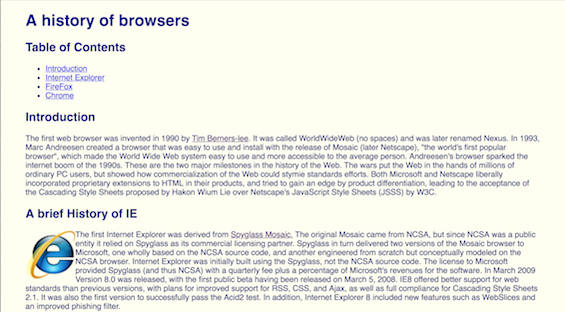

If you told me to take a block of granite and use it to create a piece of art, I wouldn’t even know how to begin, you can give me some tools like a chisel and a hammer and I would start hammering away just to see what works and what doesn’t. This analogy is very similar to my first trial in CSS and HTML in the UI Design (Basics) section in my Software Engineering class. The tools were given to me, I finished the basic tutorial, and I was told to create a simple website, so I did, in fact I created three iterations of the same website.

Calling these iterations diamonds in the rough may be a bit too high of a praise, but with a 23:40 SD time in the first iteration to a 15:20 SD to the last, by creating something like this from scratch I would say is pretty good. Handling everything from the creation of the columns, the color of the font, the image edits, and the links in the table of contents, all hand crafted using a single HTML and a CSS file was quite an experience. The columns alone drove my time up as I tried to understand how to perfectly center each one on the same row with even spacing and don’t even get me started on the picture edits. Even the in-class exercise where we had to input links to separate websites I had an even better score of an RX time, so I would say that I can grasp the basics of CSS/HTML coding. From this point I graduated from sculpting elementary school and I was ready for the next level, UI Frameworks. 

Learning a UI Framework like Semantic UI was on par with the learning curve of the CSS/HTML, a bit steep, however I was not given a block of granite to chip away at I instead was given several LEGO pieces to build my vision. In my eyes Semantic UI allows the user to build very usable, responsive, and attractive web pages by building the website up with little building blocks and each LEGO piece is morphable into the piece that you need. Do you need a nicely centered borderless top bar menu that is fixed to its position as you scroll down? Do you need a two wide, four wide, or eight wide columns over a background picture? Or Do you need a nice footer with evenly spaced elements in a list? Semantic can provide the blocks, but you have to stick them together. The more I used Semantic, in class projects and personal, the more I began to appreciate the helpfulness of a well put together framework, however upon completing the E36: Choice Website I began to see certain flaws.

Semantic does provides very useful components that are “ready-to-use” and can be maintained very easily which is a great boon to software engineers who sell their skill to clients looking for an easy to maintain website. For the client, who may not be versed in the knowledge of webapps, Semantic provides a great way to just get busy with the front-end code to start modifying it to their pleasure. However, as with all frames, it contains the creativity of the creator. If the developer wants to create his or her own menu system or perhaps custom elements on the website, the UI framework that is loaded will definitely conflict with personally created elements. This looks like an easy fix from small end projects however as the project increasingly grows every issue grows with it. I myself saw some limitations with the Choice Website exercise as I could not do some elements in the website I chose to copy and thus had to settle with CSS editing. This CSS editing proved to be a an even larger burden as it constantly conflicted with the grid and column system Semantic had and I was forced to just sit there and deal with it. If my knowledge on frameworks was greater than what I have now as I write this I would’ve created my own grid system that allows more fluidity and thus can handle my CSS edits. 

Here is the link to the project.

In conclusion, Semantic UI is a great tool for web developers who develop nice front-end websites for clients who want to maintain the website by themselves. It allows an easy grasp on website building and a grasp on frameworks as well. The flaws are minor in my case for now as my knowledge is lacking however as my skill grows in this subject I may find that I am stepping away from premade frameworks and creating websites from my granite blocks again.
