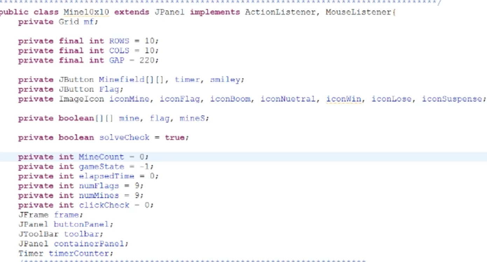

This Minesweeper was developed as a final project in ICS 211 along with 3 other group members to test our knowledge on User Interface and Events, Breadth-First Searching, 2D array traversal, and basic Java knowledge. This game consisted of 3 modes, an easy 10x10 grid, a medium 15x15, and a hard 20x20 grid that copied mechanics from the classic Minesweeper game on windows. 

For this project, I was the lead programmer incharge of managing my other group members contributions to the source code and wrote the code for the UI shown [here](https://youtu.be/hz9P9J7P4Wc) and the main Breadth-First Search function. I utilized jPanelGrid for the main menu along with the actual game able to manage event clicks and use stock images from the internet along with personally designed icons for interactions. For the search function I used Breadth Search to iterate recursively through my 2D array to find the mines and only reveal blocks that have a value of a number up to 8. My main focus however was group collaboration and management as I made sure to keep everyone up to date to code changes, reminders of due dates, and possible meet up times. This allowed personal growth as I was able to learn how to properly manage a team making sure I accounted for all weaknesses and strengths as well as allow freedom in the coding process.

Being the leader in this group along with my roles as a programmer allowed me to experience a more professional setting of a work enviroment as I learned to be able to rely on my group members rather than worry about their contributions. This professionalism also helped me experience proper managing techniques as I was able to be sure I was not to demanding with their code and allowed freedom for thier parts.

For more information on the source code click [here](https://github.com/kainyogi/Minesweeper).
 
