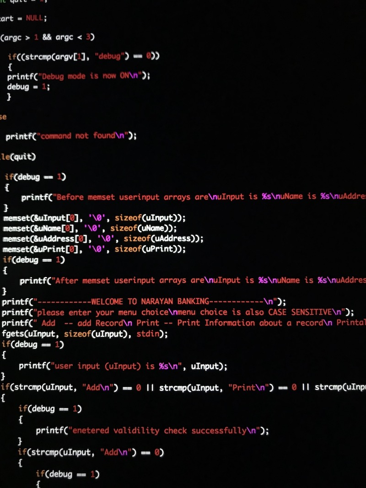

  

This Bank Database was a project that was done in my Program Structure class At UH Manoa and was utilized as a test of my skills to follow customer specifications and basic C knowledge. This tested my knowledge on not only customer interaction but also efficient sorting and searching through a large amount of data that was to be collected through a User Interface. I learned about intuitive design as well as proper coding structure to be sure that my code can be maintained by anyone with utilization of proper documentation. After this project I would say that I am proficient in the C language, Unix Command-lines, and SCCS.

For this project, I worked as a lone programmer utilizing C as the primary coding language along with the Unix Shell command-lines as well as SCCS and I was able to produce an intuitive User Interface that collected data from User Input and sorted said data into a database for future use. My main focus was the data collection which is able to check for correct inputs, flush buffers, utilize multiple lines for data collection, and sort the data for easy reading and retrieving. Throughout this process I familiarized myself with Makefiles and SCCS for version storing and efficient compile times as well as command line syntax which is able to enter a debug mode to check for any errors in the collection process. I then coded the User Interface function to be as intuitive as possible making sure all customers and future users are able to follow along efficiently so that there is no confusion from the front end. The user interface consisted of both adding and deleting nodes from the database and retriving information based on account number. For the sorting of the data I utilized Doubly-linked lists that were able to use insertion sorting as its main sorting function with the functionality of binary searching for data retrieval. From there I was able to make sure that the data was not lost and infact stored locally so that the source code as well as the data can be transported without error. 

While working on this project I learned about proper documentation handling and client interaction being able to be sure that what the client wants is what I program into the service. This code also taught me to be as efficient as possible with the Makefiles as I was able to compile large amounts of code in no time at all. Above all this taught important knowledge in User Interface design as you must assume the worst when programming for a user as that is where all the bugs will come from.

You can view the Source Code [here](https://github.com/kainyogi/Bank-Database)

