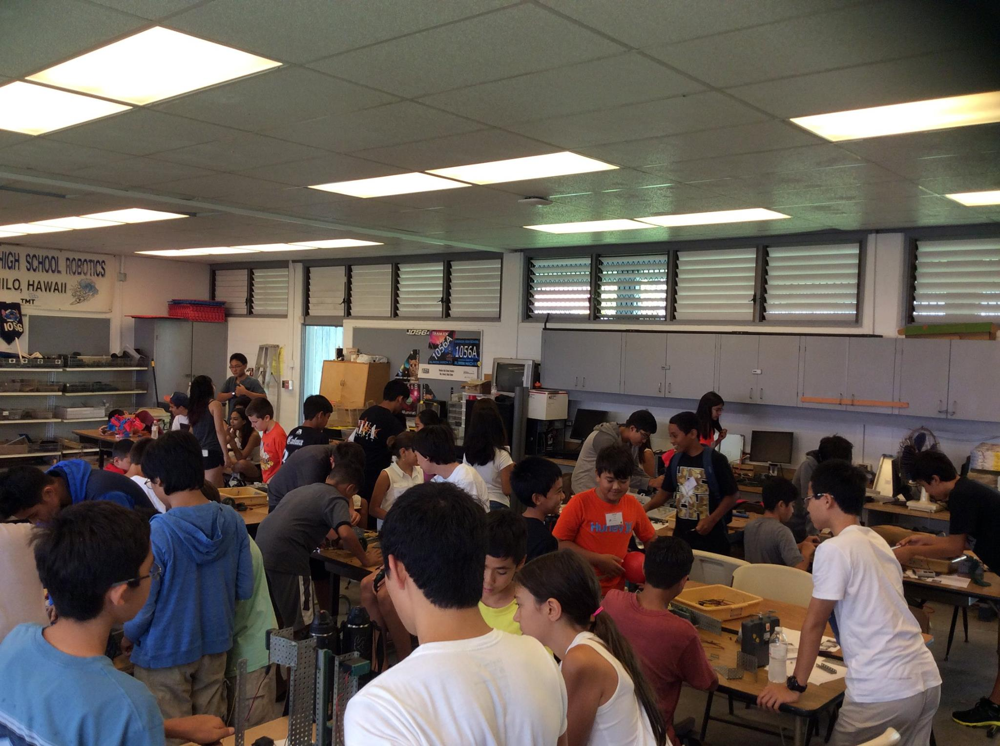

  

The Hawaii Island Robotics Academy, or HIRA for short, is a 2 week camp focusing on the STEM field and opportunities children can have while attending school. This camp is run by Dale Olive, a physics teacher at Waiakea High School, along with volunteer students to help manage classes of 30 kids ranging from 3rd-8th grade to showcase robotics in Hawaii. The program consists of showcasing robots the school has built ranging from tiny 1 cubic inch robots to 6 foot giants of metal all to mentoring students in building and programming robots with VEX and Lego MindStorm Kits.

As a volunteer for many years I have managed a very large magnitude of children from all grade levels and taught both basic building and programming techniques in a manner that appeals to them. As a mentor I have to be able to manage many types of personalities from shy to outgoing and humble to competitiveness all while managing groups that can range from 4 to 8 children on one team. However my main focus is to spark interest in the STEM field by showing that it is not only fun but very rewarding as a career path. 

From volunteering for many years I have gained leadership qualities and is able to identify possible weaknesses in a group and use that as a foundation to complete any task. This has also taught me that there is not one way of doing things but a multitude of ways to approach any problem be it complex or very simple and I was able to use this knowledge in group work in college and lead many groups to achieving our greatest.

You can view the Main website [here](http://sciencefactoryhawaii.com/hira-summer-2016-registration-forms/).
